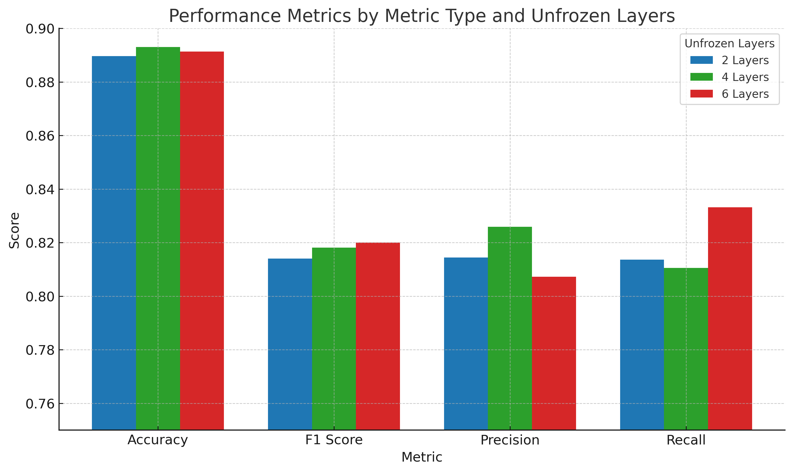

# 🎓 Automated Detection of Usability Issues Tech-Support Data
**Bachelor Thesis – Kristianstad University**

| Item | Detail |
|------|--------|
| **Authors** | Ahmed Radwan · Jwan Mardini |
| **Supervisor** | Kamilla Klonowska |
| **Examiner**  | Craig Lindley |
| **Semester**  | Spring 2025 |
| **Industry Partner** | ***XXX*** |

---

## 📌 Thesis Title
**A Classification-Based Approach to Detecting Usability Issues in Technical Support Data Using Zero-Shot LLM Labelling and BERT Fine-Tuning**


---

## 🧭 Project Overview
The company provided an archive of ≈ 235,000 tech support tickets.  
We developed a pipeline to identify usability-related issues in technical support data using:

Our pipeline:

1. **Zero-shot labelling** with an internal **71 B-parameter LLaMA-3 LLM**  
2. **Expert spot-check** on 50 tickets (≈ 90 % agreement, κ = 0.78)  
3. **Supervised fine-tuning** of BERT (2 / 4 / 6 unfrozen layers)  
4. **Evaluation** on a held-out test set (best model F1 = 0.82)  
5. **Workload reduction analysis** (≈ 80 % of tickets filtered before human review)

The project was carried out with ***XXX*** and leverages real-world support case data to reduce the UX review workload and uncover actionable usability insights.


---

## 🗂️ Project Structure
```bash
BACHELOR-THESIS/
├── data/
│   ├── raw/                    
│   │   ├── cases.csv
│   │   └── comments.csv
│   ├── processed/-----.csv
│   ├── final/--------.csv
├── llm/
│   ├── usability/
│   ├── ------.csv    
├── results/
│   ├── ------.png
│   ├── ------.xlsx
│   ├── ------.csv
├── scripts/
│   ├── api_keys.py
│   ├── utils.py
├── 01_clean_cases.ipynb
├── 02_clean_comments.ipynb
├── 03_merge_cases_comments.ipynb
├── 04_labelling_combined_dataset.ipynb
├── 05_fine-tuning_BERT.ipynb
├── 06_BERT_training_metrics-visualization.ipynb
│
├── xx_subcategorizing_usability_cases.ipynb
├── experiment_results.csv
│
├── prisma_llm.py
├── requirements.txt
├── README.md
├── .venv/
├── _pycache_/
└── .gitignore

```
---

## ⚙️ Setup Instructions

### 1. Clone the Repository

```bash
git clone https://github.com/your-username/BACHELOR-THESIS.git
cd BACHELOR-THESIS
```


### 2. Set Up a Virtual Environment (Optional)


```bash
python -m venv .venv
source venv\Scripts\activate       # On Mac:.venv/bin/activate
```

### 3. Install Dependencies

```bash
pip install -r requirements.txt
python -m spacy download en_core_web_sm
```

## 🚀 Execution Steps

### 🔹 1. Data Preparation
- Run `01_clean_cases.ipynb` to clean ticket descriptions.
- Run `02_clean_comments.ipynb` to clean tech support comments.
- Run `03_merge_cases_comments.ipynb` to combine cleaned data into a single dataset.

### 🔹 2. LLM-Assisted Labeling
- Execute `04_labelling_combined_dataset.ipynb` to apply LLM zero-shot labeling using the 71B LLaMA-3 model.
- Saves a labeled dataset for supervised learning.

### 🔹 3. BERT Fine-Tuning
- Run `05_fine-tuning_BERT.ipynb` to train a BERT classifier on the labeled dataset.
- The notebook explores freezing different numbers of layers (2, 4, 6) for performance tuning.

### 🔹 4. Evaluation and Visualization
- Use `06_BERT_training_metrics-visualization.ipynb` to plot training loss, accuracy, and compute evaluation metrics (F1, precision, recall).

---
## 📈 Results Summary

| Unfrozen Layers | Accuracy | F1 Score | Precision | Recall | Training Time (s) |
|-----------------|----------|----------|-----------|--------|-------------------|
| 2               | 0.8896   | 0.8140   | 0.8144    | 0.8136 | 52,710.92         |
| 4               | 0.8930   | 0.8181   | 0.8259    | 0.8105 | 37,450.00         |
| 6               | 0.8913   | 0.8200   | 0.8072    | 0.8332 | 34,845.31         |

The best **F1 score** and **recall** were achieved with **6 unfrozen layers**, while **4 unfrozen layers** provided the highest precision. All models demonstrated strong classification ability, with AUC scores above 0.94. The 6-layer model was preferred for its overall balance between performance and efficiency.

Approximately **80% of support cases** were filtered out as non-usability by the zero-shot LLM stage, substantially reducing the workload for UX review.

## 🖼️ BERT model comparison



---

## 🧪 Additional Notes

- The labeling phase used a **71B parameter LLaMA-3-based model** deployed internally at ***XXX***.
- The input for classification included both the **original support case description** and associated **comment history**, which improved label quality from ~50% to ~90% agreement with UX experts.
- All case records were **anonymized** before processing, with personal data (names, emails, IPs, etc.) removed via a regex and named entity recognition (NER) pipeline using spaCy.
- The entire pipeline, from zero-shot labeling to BERT training, was executed securely within ***XXX’s internal infrastructure*** in accordance with GDPR and under a **non-disclosure agreement**.
- The trained classifier is designed for **internal UX research use only** and is not deployed in any customer-facing environment.

- `prisma.py` includes LLM prompt logic and PRISMA-guided labeling.
- `xx_subcategorizing_usability_cases.ipynb` is used for optional analysis of usability issue types to help the future work of subcategorizing the usability cases.
- Training and evaluation leverage Hugging Face Transformers and scikit-learn.
- Model training and evaluation were carried out entirely within ***XXX*** managed infrastructure.
- This solution supports internal UX improvement only and is not intended for production deployment or customer-facing systems.

---

## 📄 License

This project is part of a university thesis in collaboration with a company and not intended for commercial use.


## 🧠 Acknowledgments
Thanks to our supervisor Kamilla Klonowska, our examiner Craig Lindley, and the UX Design team at ***XXX*** for their feedback and support throughout the project.


## 👥 Contributors
- [Ahmed Radwan](https://github.com/Ahmedradwancs)
- [Jwan Mardini](https://github.com/JwanMardini)